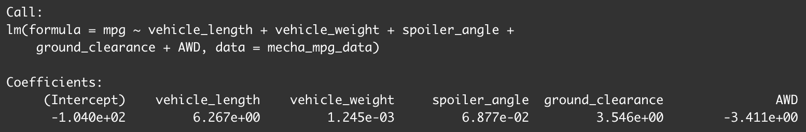
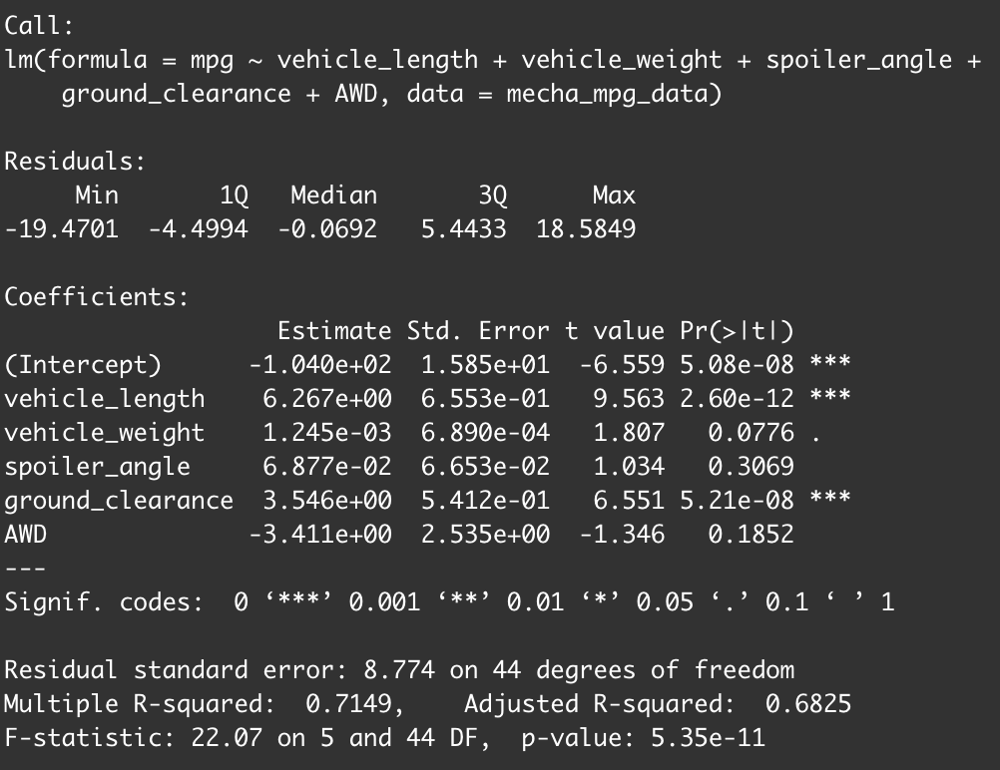
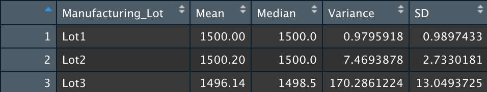
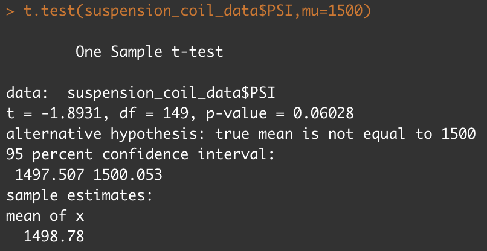
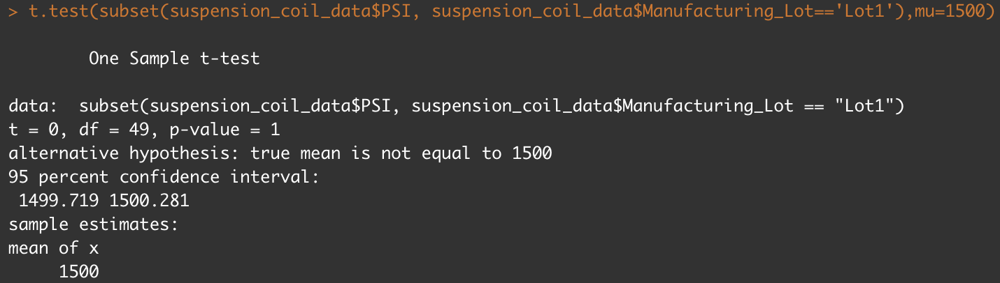
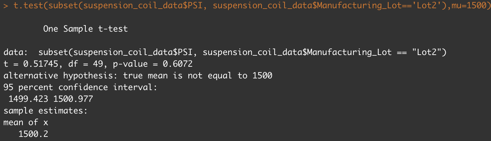

# MechaCar_Statistical_Analysis

## Linear Regression to Predict MPG

The results of performing Linear Regression are below.

### Linear Regression Output

### Summary Output

### Which variables/coefficients provided a non-random amount of variance to the mpg values in the dataset?
Seen in the summary output above, the Pr(>|t|) values that are lower that 0.05 would be provide a non-random amount of variance to the mpg values. These variables are the vehicle_length and ground_clearance. 

### Is the slope of the linear model considered to be zero? Why or why not?
No the slope of the linear model is not considered to be zero. As show above in the summary output, we see multple variables/coefficients which have a Pr(>|t|) value less that 0.05. Reviewing the estimate column in the summary output, we see that there are non-zero values for these coefficients. These values also match with the Linear Regression Output coefficient.

### Does this linear model predict mpg of MechaCar prototypes effectively? Why or why not?
Yes, from the datapoints that were analyzed, we can effectively see what parameter would help with MPG for the mecha cars. There are effectively 2 parameters that the engineers are able to tweak to try and maximize MPG. These are vehicle_length, and ground_clearance. As these values increase, so too, does the MPG. We also see that the R-squared value is 0.7149. This means that there is a strong correlation between the linear model and the data.

## Summary Statistics on Suspension Coils

Reslts of the summary statistics are below:

### Total Summary Output

### Lot Summary Output

### The design specifications for the MechaCar suspension coils dictate that the variance of the suspension coils must not exceed 100 pounds per square inch. Does the current manufacturing data meet this design specification for all manufacturing lots in total and each lot individually? Why or why not?
If one were to look at only the Total Summary Output, the variance is 62.3. This is within design specification. However, when we drill down to each lot, we see that Lot1 and Lot2 have very low variance, while Lot3 has a very high value of 170.3. Lot3 does not meet the design specifications, and as such this should be investigated.

## T-Tests on Suspension Coils

Results of the T Test outputs are below.
### T-Test Output (All Lots)

From the above image we see that the p-value is 0.06028. Assuming our significance level was the common 0.05 percent, our p-value is above our significance level. Therefore we can state the the two means are statistically similar as we cannot reject the null hypothesis.

### T-Test Output (Lot 1)

From the above image we see that the p-value is 1. Assuming our significance level was the common 0.05 percent, our p-value is way above our significance level. Therefore we can state the the two means are statistically similar as we cannot reject the null hypothesis.

### T-Test Output (Lot 2)

From the above image we see that the p-value is 0.06072. Assuming our significance level was the common 0.05 percent, our p-value is above our significance level. Therefore we can state the the two means are statistically similar as we cannot reject the null hypothesis.

### T-Test Output (Lot 3)

From the above image we see that the p-value is 0.04168. Assuming our significance level was the common 0.05 percent, our p-value is below our significance level. Therefore we can state the the two means are not statistically similar and we can reject the null hypothesis.

## Study Design: MechaCar vs Competition

The following statistical study will quantify how MechaCar performs against the competition over the previous years.

### What metric or metrics are you going to test?
Metrics to be tested are user reviews over the previous years. 

### What is the null hypothesis or alternative hypothesis?
The null hypothesis will be that there are no statistical differences between user reviews on MechaCar vs the Competition.
The alternative hypthesis will be there will be a difference in user reviews between MechaCar vs the Competition.

### What statistical test would you use to test the hypothesis? And why?
A Two-Sample t-test would be used to test the hypothesis. If the p-value is greater than 0.05 we can assume that there there is no statistical difference and therefore MechaCar and the competition are performing roughly at the same level. If the p-value is less than 0.05, we can reject the null hypothesis.

### What data is needed to run the statistical test?
For both MechaCar and the competition, we need average user reviews per model over historical data.

